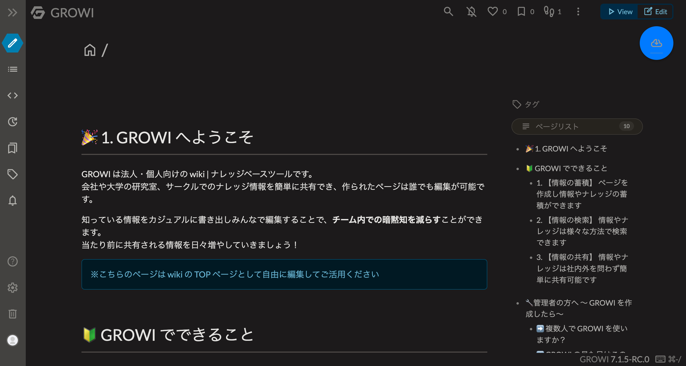
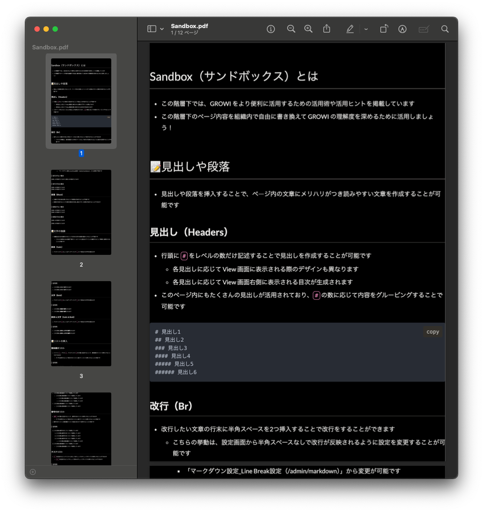

# GROIW Plugin PDF Export

This is a GROWI plugin to export a page to PDF.

## Usage

```markdown
::pdf
```

It shows a button to export the page to PDF.



When you click the button in view page, the page is exported as PDF.



## Notice

This plugin doesn't support editing the page.

## License

MIT

